# Data Analysis Report

### Narrative on Data Analysis of 'goodreads.csv'

The analysis of the 'goodreads.csv' dataset reveals several intriguing insights regarding its structure, contents, and patterns. The dataset contains a total of 10,000 records with various attributes related to books listed on Goodreads. Here's a detailed breakdown of findings based on the summary statistics, missing data, and correlation matrix.

#### 1. **Dataset Structure**

The dataset contains the following key columns:
- **Identifiers**: Unique IDs for books, including `book_id`, `goodreads_book_id`, `best_book_id`, and `work_id`.
- **Publication Details**: Attributes like `original_publication_year`, `original_title`, and `title`.
- **Rating Information**: Information pertaining to ratings, such as `average_rating`, `ratings_count`, `work_ratings_count`, and detailed breakdowns of ratings from 1 to 5 stars.
- **Authors and Language**: Fields for authors and language codes provide insights into the demographics of the content.

#### 2. **Summary Statistics Overview**

- **Year of Publication**: While the average original publication year is 1982, there are outliers such as a minimum value of -1750, indicating either data entry errors or misclassified entries.
- **Average Ratings**: The dataset has a mean average rating close to 4.00 (4.00 ± 0.25). This suggests that generally, the books in this dataset are well-received by readers.
- **Ratings Distribution**: The numerical breakdown of book ratings indicates that books tend to receive more 4 and 5-star ratings, implying a positive view of the books listed.
  
- **Books Count**: The average number of books per entry in the dataset is roughly 75, with a maximum of 3,455, indicating a wide variance in how many books have been published per title or author.

#### 3. **Missing Values**

About 700 entries are missing `isbn`, 585 are missing `isbn13`, and `original_title` has a significant number of 585 missing entries. The language code lacks information for 1,084 entries. This pattern may influence comprehensive analyses since certain books may be less identifiable or hard to categorize without these fields.

#### 4. **Correlation Analysis**

The correlation matrix provides insights into relationships between different numerical variables:

- **Strong Positive Correlation**: `ratings_count`, `work_ratings_count`, and `work_text_reviews_count` are correlated with each other and with 1-5 star ratings. This implies that popular books typically receive more ratings and text reviews.
  
- **Ratings vs. Average Rating**: When comparing the numeric ratings (1-5), the highest correlation is observed among these ratings, particularly between `ratings_4` and `ratings_5` submissions. However, the correlation with `average_rating` is comparatively weaker, suggesting that a book's rating can be high even if low numbers of votes were submitted, and conversely, a high number of ratings could still yield an average score.

- **Books Count**: There’s a negative correlation between `books_count` and the rating attributes, especially with ratings points. This relationship suggests that books with a high volume of publications may receive more polarized views in assessments possibly due to factors like lack of quality control, diverse styles, or overwhelming choices for readers.

#### 5. **Trends and Anomalies**

- **Dominance of Authors**: Stephen King appears to be the most frequently cited author with 60 listings. This reflects a trend where certain authors dominate certain genres or categories within the dataset. His works may need further examination to determine thematic trends or the specifics of his appeal.
  
- **Publication Year Trends**: The average book in this dataset was originally published around the early 1980s, which may coincide with trends in the publishing industry or cultural shifts occurring in the late 20th century. 

- **Outliers in Ratings**: Books with exceptionally high ratings counts (for instance, a maximum of 4,780,653) merit scrutiny. These may represent significant titles or errors in data entry, particularly when pairs of ratings count and average ratings do not correspond.

#### 6. **Recommendations for Further Analysis**

To gain more in-depth insights, the following analyses are recommended:
- **Genre-based Analysis**: Segment the dataset by genre if such a classification exists, which could reveal deeper trends.
- **Temporal Analysis**: Assess how average ratings change over time, per year of publication, which could provide insights into evolving reader preferences.
- **Missing Data Treatment**: Look into strategies for dealing with missing `isbn`, `isbn13`, and `original_title` fields, as these may impact the ability to merge or compare data with other datasets.

In summary, the analysis of the 'goodreads.csv' dataset highlights key insights into book ratings, author dominance, publication trends, and correlations among the data that reveal a landscape of reader behavior on one of the world's largest book review platforms. These findings lay a solid foundation for further exploration and understanding of literary trends over time.

## Visualizations

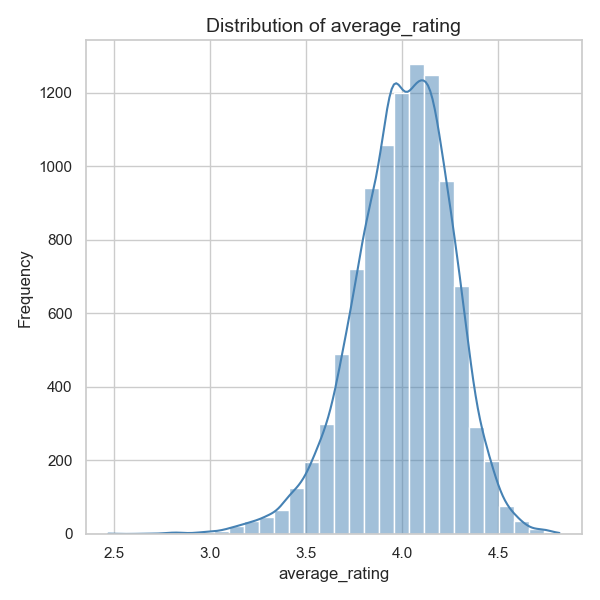
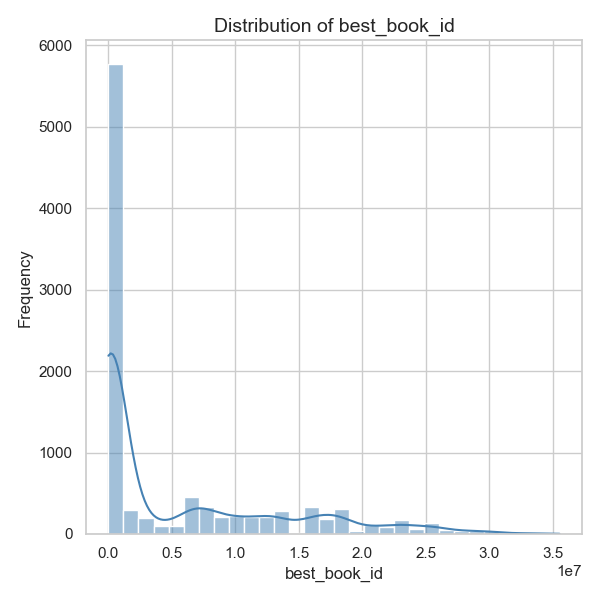
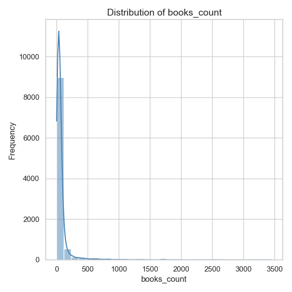

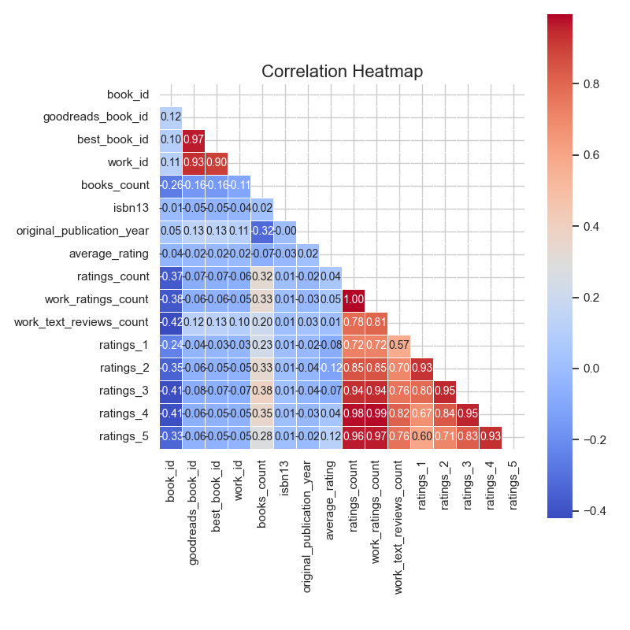
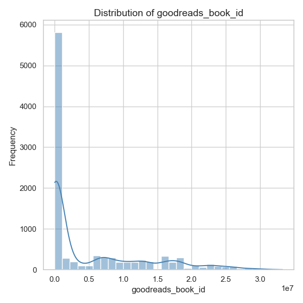
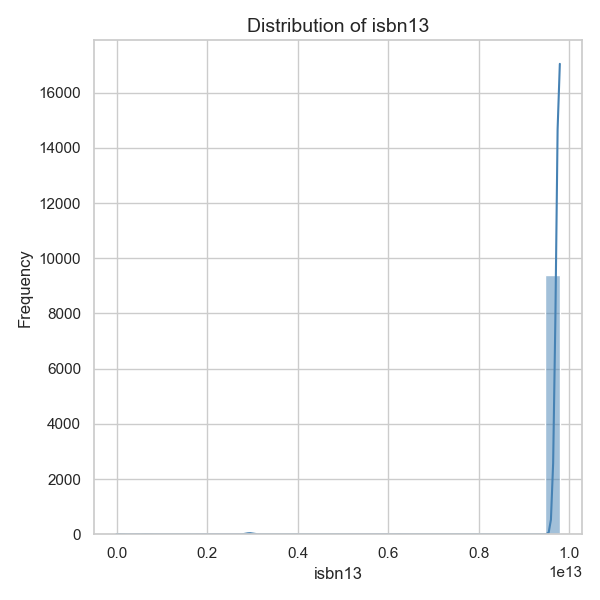
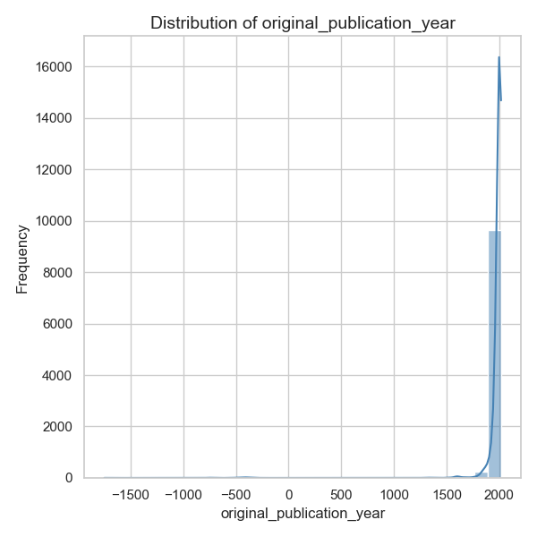
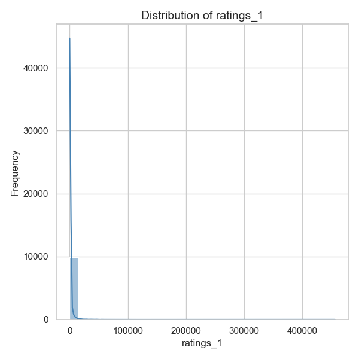
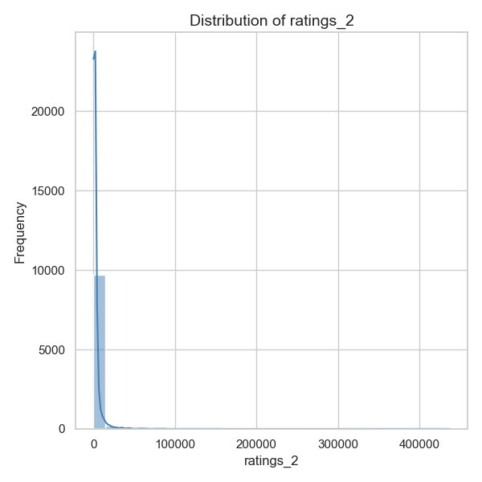
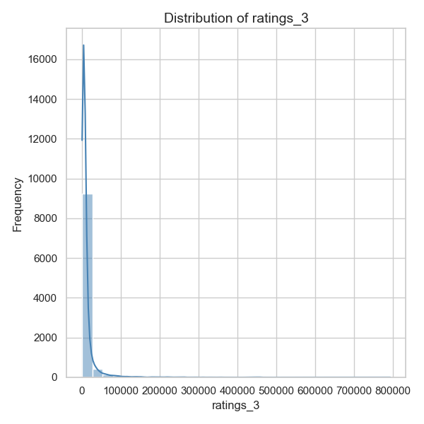
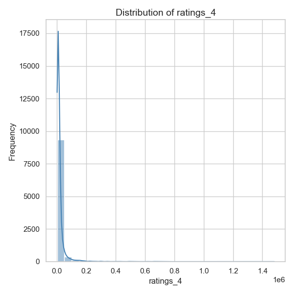
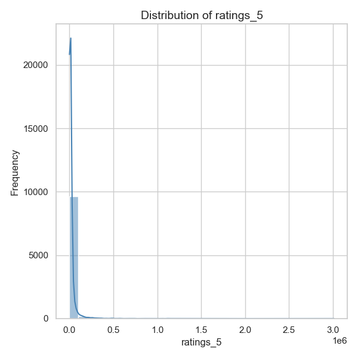
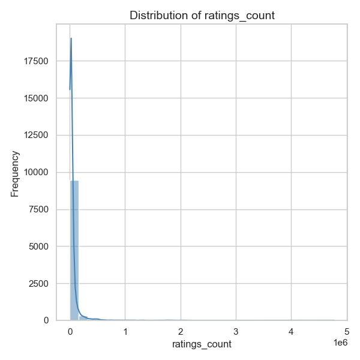

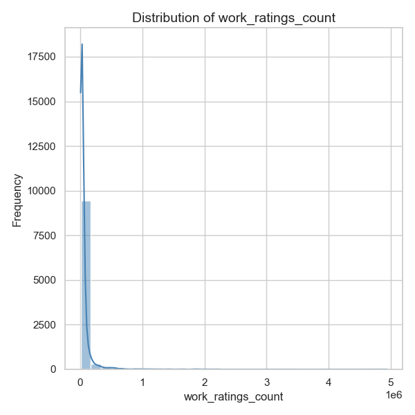
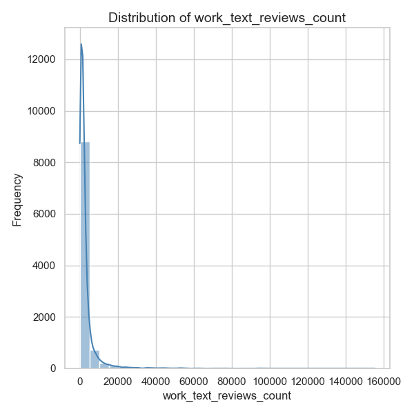