# Data Analysis Report

### Data Analysis Narrative of Happiness Data from 'happiness.csv'

#### Overview
The dataset encompasses various metrics related to happiness across different countries over a span of years. Key attributes include the "Life Ladder," which serves as a measure of subjective well-being, alongside economic and social factors such as GDP per capita, social support, healthy life expectancy, and individual freedom. A total of 2363 records are available, representing data from 165 countries between the years 2005 to 2023.

#### Summary Statistics

1. **Temporal Distribution**:
   - The average year of data is approximately 2014.76, with a range extending from 2005 to 2023. This suggests a reasonably recent and relevant dataset for assessing contemporary happiness metrics.
   
2. **Happiness Measurement**: 
   - The average "Life Ladder" score is about 5.48, with a standard deviation of 1.12, indicating variability in happiness levels across countries. The minimum score recorded is 1.281, while the maximum is 8.019, highlighting a notable disparity in reported happiness.
   
3. **Economic Indicators**:
   - The average "Log GDP per capita" is around 9.40, signifying that wealthier nations, as expected, dominate the higher end of the economic spectrum. The metrics range from a significant low of 5.527 to a high of 11.676, indicating a diverse economic landscape among the countries studied.

4. **Social Structures**:
   - The average score for "Social support" suggests a reasonably strong social safety net, with a mean of 0.81. However, the mention of missing values (e.g., 13 missing entries) raises questions about data completeness and its implications on generalization.
   
5. **Health and Well-being Metrics**:
   - A healthy life expectancy average of approximately 63.40 years illustrates the link between health and happiness. It is essential to note that there are missing values in this column (63 missing entries), which could skew the analysis if not accounted for.

#### Missing Values
The analysis highlights various missing values across critical columns:
- "Log GDP per capita" has 28 missing entries, which may impact the robustness of any assertions made between GDP and happiness.
- "Generosity" shows a significant number of missing entries (81), indicating potential issues of data collection or reporting practices affecting social relationships within the sample.

#### Correlation Analysis
A review of correlation coefficients reveals several noteworthy relationships:
1. **Life Ladder & Log GDP per capita**:
   - Strong positive correlation (0.78), supporting the hypothesis that higher economic resources are closely linked to greater subjective well-being.
  
2. **Life Ladder & Social Support**:
   - Also shows a strong positive correlation (0.72). This suggests that communities with higher social cohesion tend to report greater life satisfaction.
  
3. **Healthy Life Expectancy & Life Ladder**:
   - A substantial correlation (0.71) is observed, indicating that countries that invest in health may yield happier populations.

4. **Freedom to Make Life Choices**:
   - Displays a moderate positive correlation with "Life Ladder" (0.54), making a compelling argument for the role of autonomy in individual happiness.

5. **Perceptions of Corruption**:
   - The negative correlation (-0.43) with "Life Ladder" underscores how citizens in countries experiencing higher corruption tend to report lower life satisfaction.

6. **Affect Metrics**: 
   - Positive and negative affects have an inverse correlation (-0.33), where increased positive feelings correspond with decreased feelings of negativity.

#### Insights into Trends and Anomalies
1. **Outliers**:
   - Certain countries may serve as outliers, particularly those with exceptionally high happiness scores paired with low GDP per capita or the inverse scenario. A targeted analysis could provide more insight into these anomalies.

2. **Temporal Trends**:
   - Investigating how happiness metrics have shifted over the years could offer a deeper understanding of the social and economic changes driving shifts in well-being. The rising "Freedom to make life choices" over the years could be a focal point for such analysis.

3. **Geographical Patterns**:
   - Further investigation may reveal regional happiness patterns, especially between developed versus developing nations, potentially hinging heavily on social support and corruption perceptions.

4. **Overall Correlation**:
   - The strength of correlations identifies socio-economic factors' role in well-being, suggesting future policy directions could effectively utilize these insights to enhance happiness at both local and national levels.

### Conclusion
The analysis extracted from the happiness dataset reveals fundamental insights into the relationships between economic, social, and health indicators and overall happiness as reported through the Life Ladder metric. Despite numerous missing values and inherent complexities, the correlations suggest actionable insights for policymakers. Future research could emphasize categorical investigations, looking to fill gaps in missing data and further explore anomalies to strengthen the comprehensive understanding of global happiness drivers.

## Visualizations

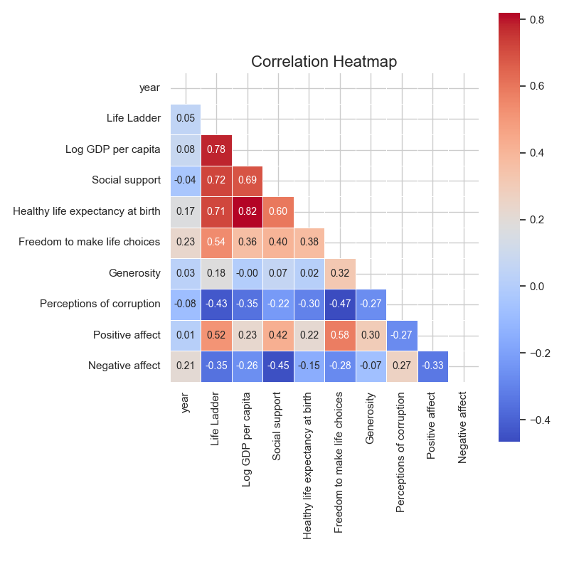
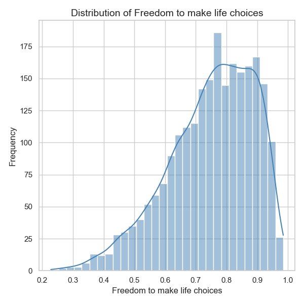
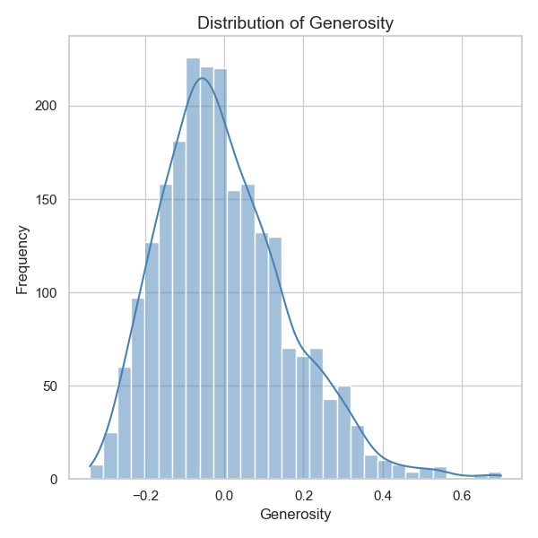
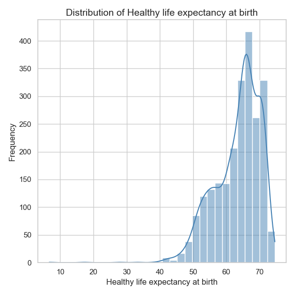
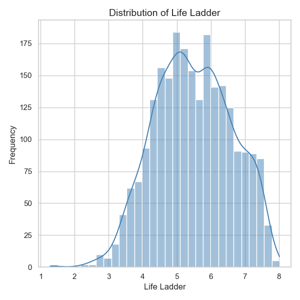
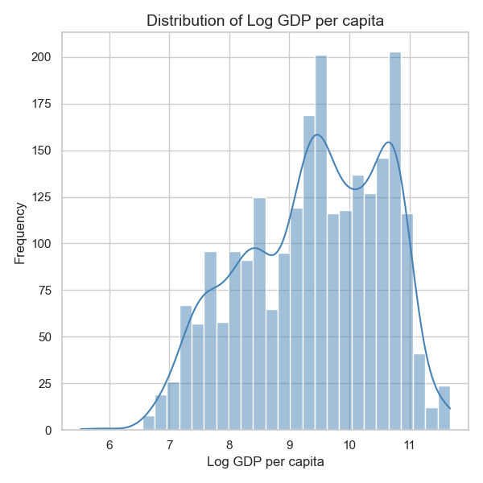
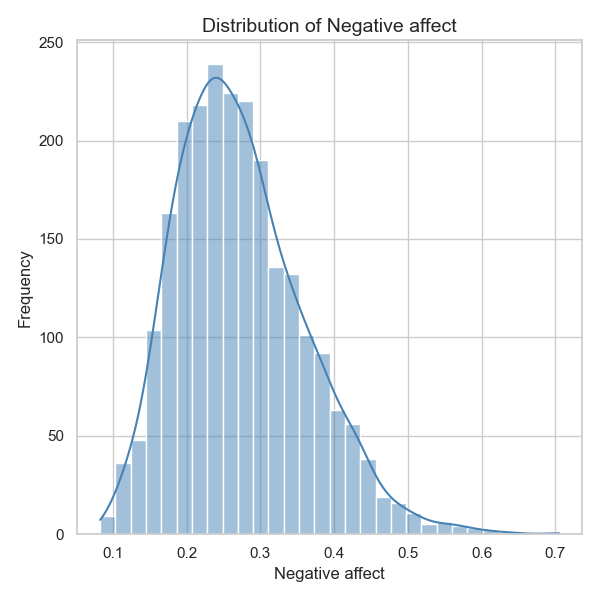
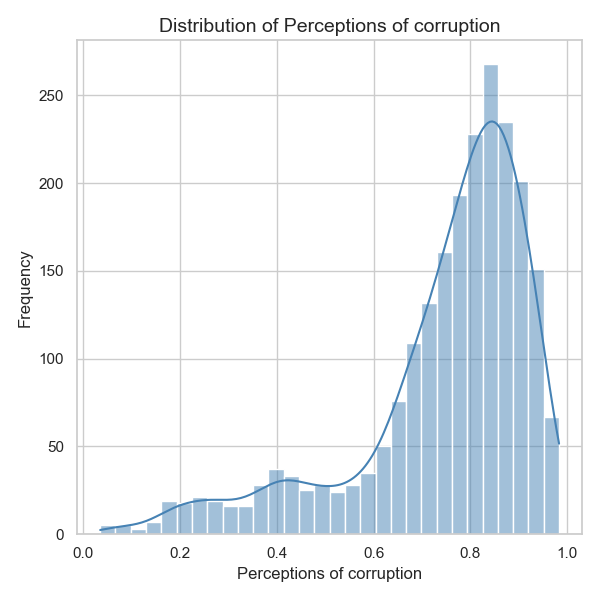
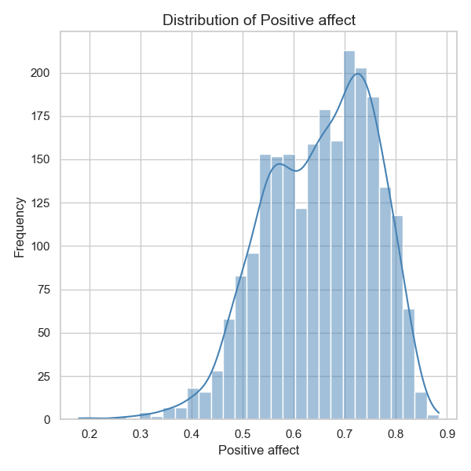
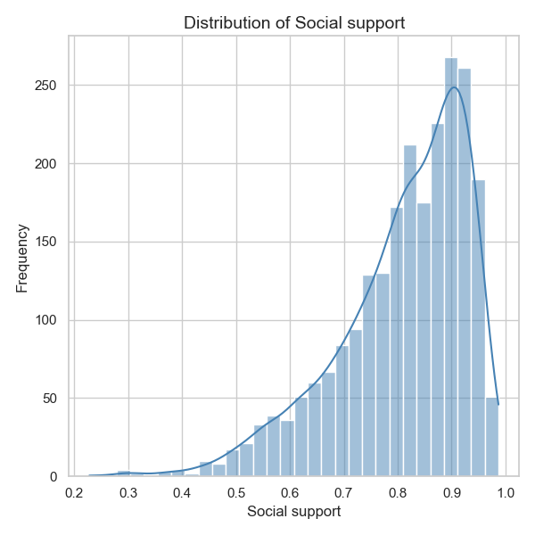
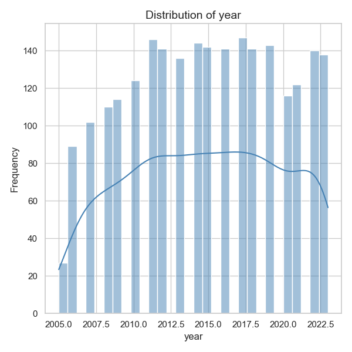