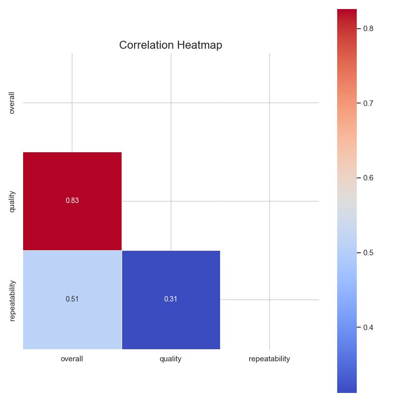
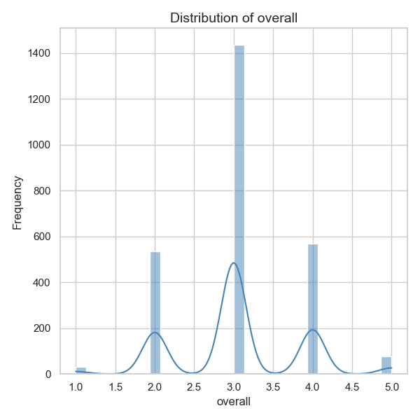
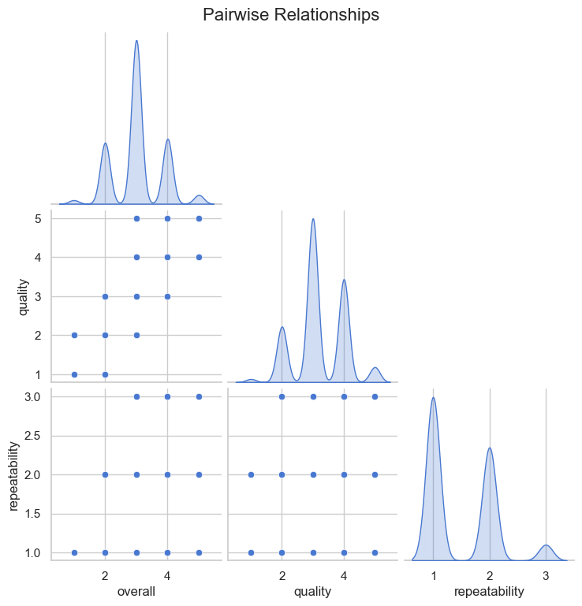
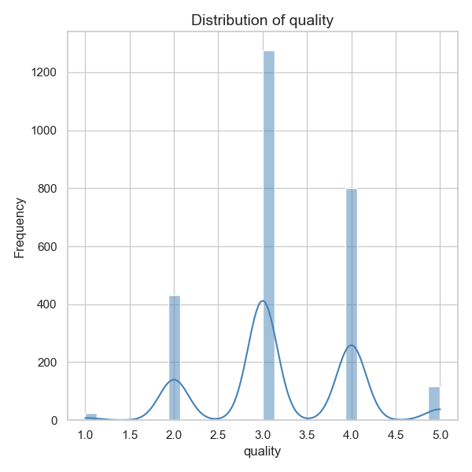
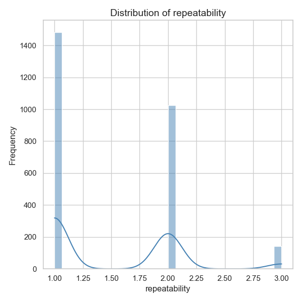
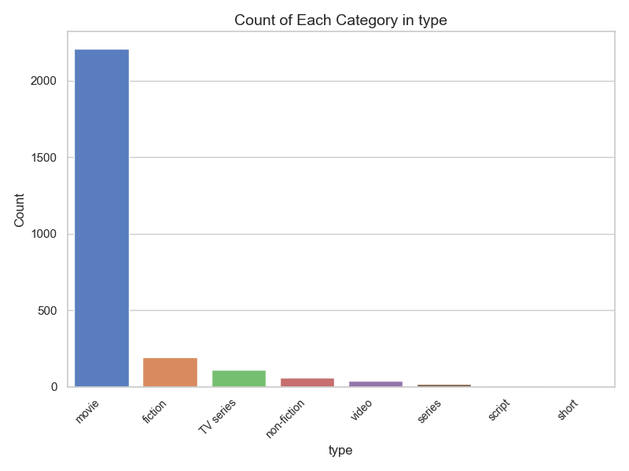

# Data Analysis Report

Based on the provided data analysis results from the 'media.csv' file, we can derive various insights into the contents and characteristics of the dataset. The analysis involves multiple dimensions, including temporal distributions, language and type prevalence, author contributions, and quality metrics. Here’s a comprehensive narrative of the findings:

### Temporal Distribution of Data

1. **Data Range**: The dataset consists of 2,553 entries, reflecting records from 2,055 unique dates. This suggests a diverse timeframe of media contributions. Despite the unique dates, the most frequent entry occurs on '21-May-06', indicating that this date features prominently in the dataset, possibly due to a significant event or release.

2. **Missing Values**: There are 99 missing dates, pointing to potential gaps in data collection. It is crucial to explore patterns around these missing values, as temporal gaps could bias trend analyses or insights focused on specific timeframes.

### Language and Media Type Dominance

1. **Language Distribution**: The language column reveals that English is the most prominent language in the data, with 1,306 entries accounted for. This suggests a strong preference or availability of media in English, highlighting its global appeal compared to other languages, which collectively account for fewer entries.

2. **Type of Media**: A significant focus on 'movies', which account for 2,211 entries (approximately 83.3% of the dataset), indicates that this dataset heavily skews towards film media. This reinforces the need to contextualize analyses and insights around this medium.

### Titles and Creators

1. **Title Frequency**: The title 'Kanda Naal Mudhal' appears 9 times, denoting this as the most frequently featured title. This could warrant further investigation to understand why this particular title is repeatedly mentioned—perhaps a re-release, restoration, or significant cultural impact.

2. **Creators (By)**: The dataset includes contributions from 1,528 unique creators, with Kiefer Sutherland noted as the most prolific contributor (48 entries). Understanding his contributions can provide insights into the diverse impact of specific individuals in the dataset, especially related to films or media that may resonate with a particular audience demographic.

### Quality Metrics Analysis

1. **Quality Ratings**: The quality of the media is assessed on a scale, with an average rating of approximately 3.21 out of 5. This indicates that the quality of media in this dataset is generally perceived positively. The ratings are predominantly centered around the mid-range, as reflected by the 25th, 50th, and 75th percentiles all being around 3 or above.

2. **Overall Ratings**: The overall mean rating stands at approximately 3.05, providing a modest assessment of the media content. This score becomes significant when cross-analyzed with the quality metrics, given the strong positive correlation (r = 0.83) between overall ratings and quality, suggesting that higher quality often corresponds with higher overall ratings.

### Repeatability Insights

1. **Repeatability Ratings**: The mean of approximately 1.49 for repeatability—with a maximum score of 3 and a prevalent score of 1—indicates that there is a low tendency for users to rewatch or engage with the media. The scoring system suggests that many entries are perceived as one-time experiences rather than having high rewatch value.

2. **Correlation with Ratings**: A moderate positive correlation exists between repeatability and overall ratings (r = 0.51). This could imply that media which receives higher ratings may have a slightly higher likelihood to be engaged with more than once, although this is not a strong trend.

### Recommendations for Future Analysis

1. **Investigate Missing Dates**: Understanding why there are missing dates (particularly the highest frequency missing years) could help improve data quality and collection strategies.

2. **Explore Less Represented Languages**: Further analysis could involve focusing on the media represented in the less common languages to uncover unique insights or underrepresented narratives.

3. **Examine Contribution Patterns**: A deeper dive into the contributions of prolific creators could reveal patterns in genre, style, or impact that may influence general viewer preferences.

4. **Cultural Impact Studies**: Considering the prominence of certain titles and creators, correlation studies could yield valuable insights into social or cultural impacts reflected through media consumption trends.

By examining these different aspects of the dataset, we can appreciate its complexities and leverage these insights for strategic media analysis and potential recommendations in media consumption and production practices.

## Visualizations

